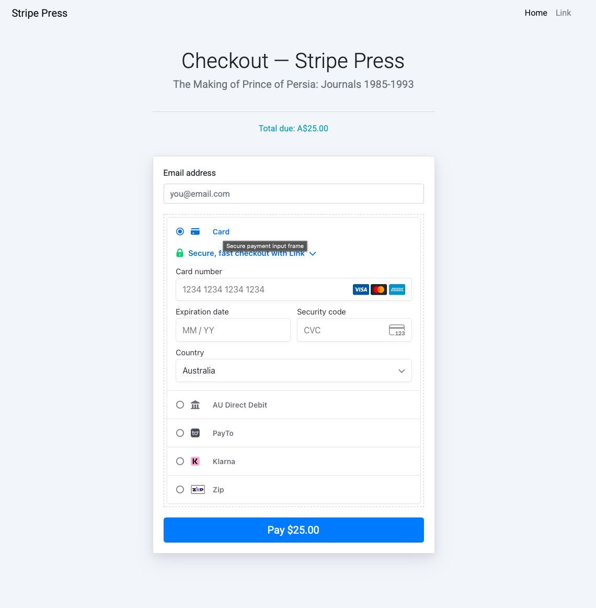
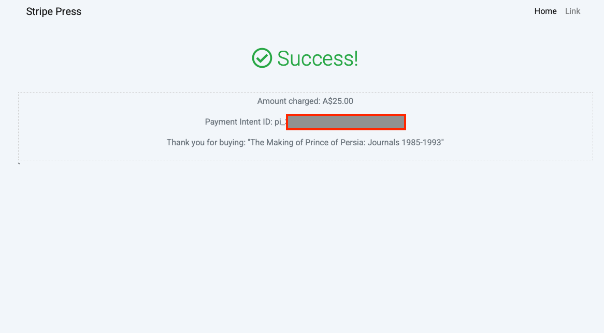
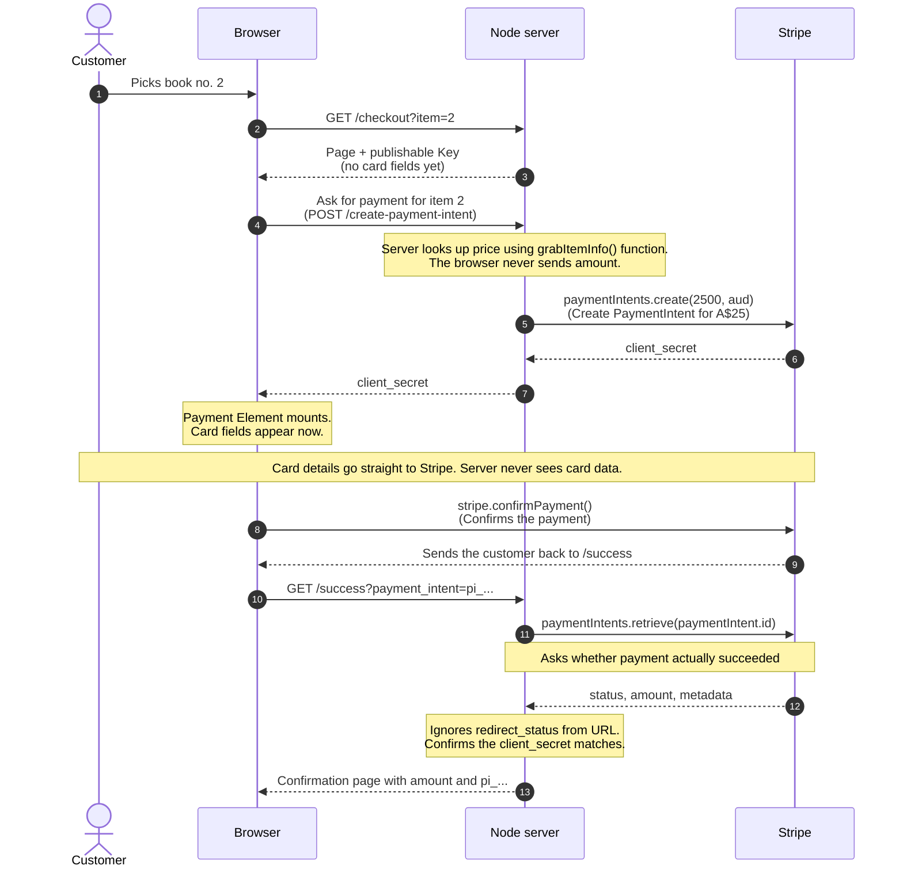

# Stripe Press - Payment Element Demo
**Welcome to Stripe Press! A simple storefront that takes a live test-mode card payment with Stripe Elements, then shows the buyer exactly what they were charged and the PaymentIntent ID that proves it.**

This demo is built using Node.js & Express as a skeleton. Use this example to explore how Stripe can integrate with a simple single purchase e-commerce business logic, allowing for coverage of multiple regions and payment methods, along with flexibility and security embedded into any website. Once you install this code, and all of its requirememts, you should be able to test this on your own local system to test various use cases

---

## What Does the Demo Do?

| Requirement | Implementation |
| --- | --- |
| Select a book to purchase | `GET /`  => `views/index.hbs` |
| Checkout with **Stripe Elements** | `views/checkout.hbs` + `public/js/checkout.js` |
| Display Total Charged and PaymentIntend ID | `GET /success` => retrieves (server-side) the amount and PaymentIntentID shown as -  `pi_xxx` |

---

## How do I get started?

As this is a Node.js based project please make sure you have installed Node, by [following the instructions here](https://nodejs.org/en/download). 

On your local machine in Terminal execute the following commands. 

```bash
git clone https://github.com/karlllewis/sa-takehome-project-node.git && cd sa-takehome-project-node
npm install         # install node dependencies (you could use pnpm or yarn as well)
cp sample.env .env         # We Will use this file next to place our API keys.
```

Next, Sign Up for a Stripe Account if you don't already have one. In the upper left-hand corner click on the drop down menu and selct "Switch sandbox" and either create a new sandbox or simply entire **test-mode**. You will be presented with **Two API keys**, both from the [Dashboard -> API keys](https://dashboard.stripe.com/test/apikeys) in **test mode**. We now want to open that .env file we created earlier to paste your keys into this file. This is IMPORTANT and necessary for the demo to work. Check Below for reference:

| Variable in .env | Key Structure | Security Note |
|---|---|---|
| `STRIPE_SECRET_KEY` | `sk_test_...` | **Never** share your secret key or expose this key to the browser |
| `STRIPE_PUBLISHABLE_KEY` | `pk_test_...` | It is used to tokenize requests to stripe, but can be shared with browser and public |

Once you have included your keys into the .env file (**note:** do NOT place these keys in sample.env). Within your terminal window inside the repo directory:

```bash
npm start   # start the service from within your directory
```

Open **http://localhost:3000**

Viola. You should see a storefront similar to this
 


Feel free to choose any of the 3 books by clicking on the 'Purchase' button and follow the instructions for inputing a card. As this is a demo, email is not necessary.



**Exercise all four use case paths described below** Any future expiry, any CVC, any postcode (we suggest not using Link now). These card numbers are described in [Stripe's Testing Page](https://docs.stripe.com/testing) if you would like further information and use cases to explore. 

| Input | Expected | 
| --- | --- |
| `4242 4242 4242 4242` | Succeeds -> Displays amount + PaymentIntentId `pi_xxx` |
| `4000 0000 0000 0002` | Declined -> Message should display under the card field |
| `4000 0025 0000 3155` | 3-D Secure Challeng, then succeeds and displays amount + PaymentIntentId |
| Browse to `http://localhost:3000/checkout?item=99` | Fails -> The server refuses to price or show an unknown item |

Every attempt appears in **Dashboard -> Payments** within seconds, with the book title attached as metadata, and every API call is replayable under **Developers -> Logs**. Worth watching alongside the app.


---

## How does this Demo work?

The visual diagram below shows the important interactions between the 3 main architectural pieces: The browser, The server, and Stripe.




#### Some Important Consideration 
1) The browser tells the server which book with its item number, but the amount it cost is derived from the server. The prices come from the grabItemInfo() function within app.js. The request could be tampered by changing the item number (changing which book you purchase), but the amount is never passed from the client side for payment.
2) The  Payment Element requires a client secret in order to mount, but in order to receive a client secret a payment Intent needs to be made. The POST is used to create a Payment Intent when the checkout page loads (allowing for a client secret to also be generated). TThis means there is potential for the Payment Intent to sit on the Dashboard waiting but never receiving payment.
3) Stripe.js renders the Payment Element within an ifram from Stripe's own origin, so whenever a user puts in payment details, that information is passed directly to Stripe and is never stored on the server or logs. This is crucial as its one of the main reasons customers benefit from Payment Elements over custom forms where PCI compliance plays a much larger role.
4) The success page of this demo actually reaches out to Stripe to get the status of the payment as opposed to simply refering to the redirect_status. This is intential to not trust information from the client side as it could be tampered with. The API call to Stripe to obtain the status is server-side using secret key.
5) This demo has been scoped for card payments, but has automatic_payment_methods enabled. Strip can offer methods that take time to settle, but we have left the use of webhooks and more advanced topics for a later date.

---

## Approach, Docs, and Helpful Resources

When attempting to develop this demo myself. The first approach was to familiarize myself with the concept of exactly are Payment Elements and how and why would they beneficial for an organization looking to provide secure and adaptable checkout options for their customers. I used Stripe's documentation to understand the how and why. This included the following docs:
*  [Stripe API 101](https://docs.stripe.com/payments-api/tour )
*  [Understanding Payment Elements](https://docs.stripe.com/payments/payment-element )
*  [Payment Element Quick Start Guide](https://docs.stripe.com/payments/quickstart-payment-intents )


The next step was to follow along with the quickstart guide and to use the example code as guides and templates for introducing the necessary changes to the existing codebase. This included creating the Payment Intents routes, configuring checkout.js, and applying the proper payment elements into the checkout page. The quick start guide is extremely useful but I used other documentation to really adjust it to my needs. I've included them below:
* [Understanding Payment Intents](https://docs.stripe.com/payments/payment-intents)
* [Payment Intents Lifecycle](https://docs.stripe.com/payments/paymentintents/lifecycle)
* [Understanding `stripe.confirmPayment()`](https://docs.stripe.com/js/payment_intents/confirm_payment)
* [Understanding `payment_intent` object](https://docs.stripe.com/api/payment_intents/object)

After getting the payment element to appear and accept my first card payment. I set out to learn more about security best practices, how to test and approach testing, and how to introduce some general best practices into the existing integration. The Docs that helped with that are:
* [Payment Element Best Practices](https://docs.stripe.com/payments/payment-element/best-practices)
* [Testing](https://docs.stripe.com/testing)
* [API Key Best Practices](https://docs.stripe.com/keys-best-practices) 

Lastly, I decided to add some small bits of polish to make it more relevant for my region (Australia). So I changed the amount to use aud and updated the HTML to reflect A$ and enabled both BECS and PayTo payment methods, so it would look familiar to what I am used to seeing in at home. 

---

## Challenges

> "Behind every beautiful thing, there's some kind of pain"
>
> *-- Bob Dylan*


Challenges were certainly felt on this journey. Each was due to misreading Stripe's docs or unfamiliarity with javascript, but most were solvable with proper documentation.

1) Let's start with the first. After creating the `/create-payment-intent` route within `app.js` and configuring `checkout.js` according to the quickstart guide, I was kept receiving "No Item Found" exceptions when attempting to select a book. This ended up being a two part problem. The intial catalog was only placed within a switch/case block within the the `/checkout` route AND the publishable key was not being sent to he browser because I was trying to have it render in the static js file instead within the handlebars file (which I admit took some heroic googling to finally figure out). So for ease, I created the same switch/case block in the `/create-payment-intent`, passing the amount from the block and it worked. 
2) This lead to issue # 2. I realized I was reusing the same code in two different routes and decided this would make more sense using an array to house the product catalog so I could have a single source of truth in this demo. That of course introduced many complexities around how to deal with undefined values, or items that didnt exist within the array as well as attempting to use the `find()` function which I found more difficult. I ended up keeping the switch/case structure and using a function instead called `grabItemInfo()` which allowed me to keep a lot of the same structure within both the `/checkout` and `/create-payment-intent` routes
3) My next challenge came after tried testing various payment methods and realized that there was no condition to check for if a payment actually succeeded and if I were to use BECS or PayTo or another Autralian based payment outside of cards, the only way to do so would be to introduce webhooks. I decided to created simple conditionals being rendered in `/success` to only show the message after calling `stripe.paymentIntents.retrieve()` and using the status object to show successful vs processing payments.
4) My last challenge was really just cleaning up the code to use try/catch blocks so the npm server would stop crashing. So I refreshed my knowledge on javascript best practices and refactored the code to use try/catch blocks when appropriate. This led to much smoother testing and less server crashes with npm

## Extensions and Improvements

**Although the demo is correct and fit to purpose on the path it was designed for and can handle a few failure cases, it certainly lacks durability**. Improvments I would suggest for making this more robust:

| Gap | Fix | Why it matters |
| --- | --- | --- |
|Full-access secret key in `.env` | Use [Restricted Keys](https://docs.stripe.com/keys#restricted-or-secret-api-keys-server-side) scoped to PaymentIntents, rotated on a schedule, and held in a more robust secrets manager | For a production deployment, practicing the priciple least priveledge significantly lowers cyber attack risk |
|Catalog currently in a `switch` | Move to a proper datastore/DB, or to Stripe Products | Changing prices or expanding catalog would require more refactoring than it should| 
|Duplicate PaymentIntents on retry | [Idempotency key](https://docs.stripe.com/payments/payment-intents#best-practices) on `paymentIntents.create()` | A double-click could lead to duplicates, so its best to follow best practices for Idempotency |
|Payment State trusted from a browser round-trip | Use signed [webhooks](https://docs.stripe.com/webhooks/handling-payment-events) | The webhook would allow for more robut delivery guarantee. Use it with signature verification from Stripe|